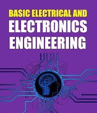

# Basic Electrical and Electronics Engineering 

### Part-A 

#### Unit-1 DC Circuits:  

Circuit elements and connected terminology, Kirchhoff’s Laws- Statement and 
Illustrations, Method of solving circuits by Kirchhoff’s law, Star-Delta 
Conversion, Ohm’s Law- Statement, Illustration and Limitation, Units- Work, 
Power and Energy (Electrical, Thermal and Mechanical).  

#### Unit-2 AC Fundamentals: 
Principle of AC Voltage waveforms and basic definitions, Peak, Root Mean 
Square and Average value of alternating current, Phasor representation of 
alternating quanties. Ohm’s Law in AC circuits, Resistive, Inductive & 
Capacitive circuits, and their series and parallel combinations. Concept of 
resonance in series and parallel circuits, Analysis of balanced Three-phase 
system with star-delta connections.  
#### Unit-3 Magnetic Circuits and Electrical Machines: 
Comparison between magnetic and electric circuits, Magnetic effects of electric 
current, Current carrying conductor in magnetic field, Law of Electromagnetic 
Induction, Self-Inductance, Mutual Inductance, Coupling Coefficient between 
two magnetically coupled circuits. Construction, Working principle, 
Classification and Applications of: Single-phase Transformer, D.C. machines 
(motor and generator), Three-phase Induction motor, and Three-phase 
Synchronous machines (motor and generator) 
### Part-B 
#### Unit-4 Digital Electronics: 
Number Systems: Binary, Decimal, Octal, Hexadecimal and their conversions, 
Logic gates: symbol and truth table - AND, OR, NOT, EX-OR, EX-NOR, Universal 
gates: NOR, NAND, Binary addition, Binary subtraction, 1’s complement, 2’s 
complement, Applications of logic gates: Half adder, full adder. 
#### Unit-5 Semiconductor Diodes: 
[Semiconductors: Intrinsic and Extrinsic, PN junction diode: working and V-I 
characteristics, Diode applications, Special Diodes: Light Emiting Diode as a 
circuit element, Photodiode, Zener diode as voltage regulator.](https://cg2024-gndec.github.io/notesbeee) 
#### Unit-6 Transistors: 
Transistors: Introduction, construction, working and characteristics, npn and 
pnp transistors, Basic configurations: common emitter, common base, common 
collector, Transistor as an amplifier and switch, Operational amplifier: 
schematic symbol, block diagram, Ideal op-amp and ideal voltage transfer 
curve
